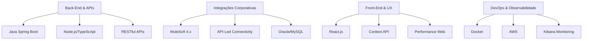

<h1 align="center"><b>👋 Benevanio Santos</b></h1>
<h3 align="center">Desenvolvedor Back-End & Integrações | Bacharel em Engenharia de Software</h3>

<p align="center">
  
</p>

---

## 📋 **Perfil Técnico**

<p align="center">
  <picture>
    
  </picture>
</p>

**Desenvolvedor especializado em sistemas corporativos de grande escala**, com foco em **integrações, APIs de alta performance e arquitetura distribuída**. Atuo em projetos críticos para a **Natura** através da **SysMap Solutions**, com entregas mensuráveis em performance e estabilidade.

**Formação Acadêmica:**
- 🎓 **Bacharel em Engenharia de Software** (Anhanguera Educacional - 2025)
- 🏛️ **Pós-Graduação em Arquitetura de Software Distribuído** (PUC Minas - 2027, em andamento)

**Atuação Atual (Natura - SysMap Solutions):**
- 🔄 **Integrações MuleSoft 4.x** - APIs corporativas com arquitetura API-Led Connectivity
- ⚡ **Performance & Escalabilidade** - Otimizações em fluxos de alta volumetria (GSP/JCB)
- 🔧 **Desenvolvimento Full Stack** - Java 6/7, Node.js 22, React.js, bancos relacionais

---

## 🛠️ **Stack Técnica**

### **💼 Experiência Comercial**
<p align="center">
  
  
  
  
  
  
</p>

### **🧪 Tecnologias & Ferramentas**
<table align="center">
  <tr>
    <td><b>Back-End</b></td>
    <td>Spring Boot, Express.js, TypeScript, RESTful APIs, SOAP</td>
  </tr>
  <tr>
    <td><b>Integrações</b></td>
    <td>API-Led Connectivity, DataWeave 2.x, Anypoint Platform</td>
  </tr>
  <tr>
    <td><b>Front-End</b></td>
    <td>React Hooks, Context API, Bootstrap, Styled Components</td>
  </tr>
  <tr>
    <td><b>DevOps</b></td>
    <td>Docker, AWS (EC2/S3/Lambda), Jenkins, Kibana, Git</td>
  </tr>
  <tr>
    <td><b>Metodologias</b></td>
    <td>Clean Architecture, SOLID, TDD, Observabilidade, Scrum</td>
  </tr>
</table>

---

## 📈 **Projetos & Métricas**

### **🏆 Resultados em Projetos Natura**
- ✅ **+40% rastreabilidade** através de logging estruturado e Kibana
- ✅ **+25% performance** em fluxos críticos MuleSoft
- ✅ **-30% tempo de resposta** em consultas otimizadas
- ✅ **-20% falhas de segurança** com políticas OAuth/TLS

### **🚀 Projetos Técnicos**
```yaml
AuthKnex:
  stack: [Node.js, TypeScript, PostgreSQL, JWT]
  features: "Controle de roles, refresh token, segurança empresarial"

RestSpring:
  stack: [Spring Boot, JPA/Hibernate, H2, Swagger]
  features: "API RESTful, versionamento, documentação OpenAPI"

MuleSoft Integrations:
  stack: [Mule 4, API-Led, DataWeave, SAP Connector]
  features: "Transformações complexas, monitoramento proativo"
```

---

## 🏗️ **Experiência por Domínio**



---


---

## 🌟 **Interesses & Cultura**

```kotlin
val personalInterests = listOf(
    "🎌 Animes & Cultura Geek",
    "🚀 Ficção Científica",
    "🎮 Game Design & Mechanics",
    "📚 Arquitetura de Software",
    "⚡ Performance Optimization"
)
```

<p align="center">
  
  
  
  
</p>

---

## 📞 **Conecte-se Comigo**

<p align="center">
  <a href="https://www.linkedin.com/in/bene-tesla/">
    
  </a>
  <a href="mailto:benevaniosantos930@gmail.com">
    
  </a>
  <a href="https://bene-tesla-dev.vercel.app">
    
  </a>
</p>

<p align="center">
  <i>"Código é poesia. Arquitetura é arte. Performance é ciência."</i>
</p>

<p align="center">
  
  
  
</p>
```
